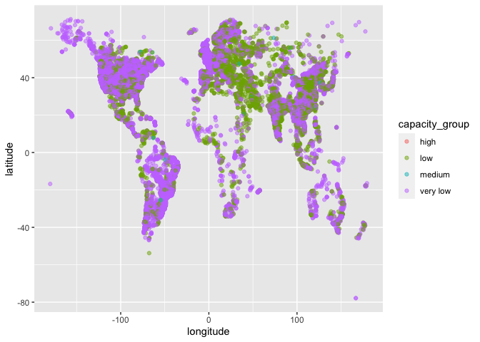
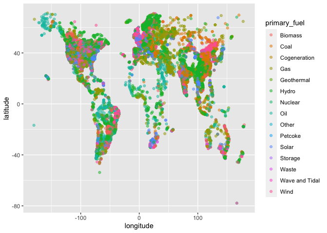

<!-- README.md is generated from README.Rmd. Please edit that file -->

# PowerPlant

<!-- badges: start -->

<!-- badges: end -->

The goal of PowerPlant is to give insights on plant capacity,
generation, ownership, and fuel type of global power plants

## Installation

You can install the released version of PowerPlant from
[CRAN](https://CRAN.R-project.org) with:

``` r
# install.packages("PowerPlant")
devtools::install_github("athenamelia/PowerPlant")
```

## Example

This is a basic example which shows you how to solve a common problem:

``` r
library(PowerPlant)
summary(PowerPlant)
#>  country_long           name            capacity_mw           latitude     
#>  Length:29910       Length:29910       Min.   :    1.000   Min.   :-77.85  
#>  Class :character   Class :character   1st Qu.:    4.774   1st Qu.: 28.86  
#>  Mode  :character   Mode  :character   Median :   18.900   Median : 40.07  
#>                                        Mean   :  186.295   Mean   : 32.50  
#>                                        3rd Qu.:  100.000   3rd Qu.: 47.13  
#>                                        Max.   :22500.000   Max.   : 71.29  
#>                                                                            
#>    longitude        primary_fuel       commissioning_year    owner          
#>  Min.   :-179.978   Length:29910       Min.   :1896       Length:29910      
#>  1st Qu.: -79.211   Class :character   1st Qu.:1986       Class :character  
#>  Median :  -3.747   Mode  :character   Median :2005       Mode  :character  
#>  Mean   : -12.459                      Mean   :1995                         
#>  3rd Qu.:  24.931                      3rd Qu.:2012                         
#>  Max.   : 179.389                      Max.   :2018                         
#>                                        NA's   :13607                        
#>     source          estimated_generation_gwh
#>  Length:29910       Min.   :     0.0        
#>  Class :character   1st Qu.:    10.1        
#>  Mode  :character   Median :    53.4        
#>                     Mean   :   847.0        
#>                     3rd Qu.:   339.9        
#>                     Max.   :450562.7        
#>                     NA's   :8119
```

## Analysis

``` r
library(tidyverse)
library(mosaic)
knitr::opts_chunk$set(
  tidy=FALSE,     
  size="small")   
```

### a. What is the total electrical generating capacity for each fuel?

SOLUTION:

``` r
PowerPlant %>% 
  group_by(primary_fuel) %>%
  summarize(total_cap = sum(capacity_mw)) %>% 
  arrange(desc(total_cap)) %>%
  select(primary_fuel, total_cap) %>%
  knitr::kable()
```

| primary\_fuel  |  total\_cap |
| :------------- | ----------: |
| Coal           | 1999520.000 |
| Gas            | 1472694.067 |
| Hydro          | 1050384.920 |
| Nuclear        |  409826.860 |
| Oil            |  262356.010 |
| Wind           |  240203.579 |
| Solar          |   63722.823 |
| Biomass        |   34435.702 |
| Waste          |   15107.214 |
| Geothermal     |   12563.550 |
| Cogeneration   |    4002.600 |
| Other          |    3757.560 |
| Petcoke        |    2497.077 |
| Wave and Tidal |     552.200 |
| Storage        |     453.600 |

``` r

PowerPlant %>% 
  group_by(country_long) %>%
  summarize(total_cap = sum(capacity_mw)) %>% 
  arrange(desc(total_cap)) %>%
  select(country_long, total_cap) %>%
  head(6) %>%
  knitr::kable()
```

| country\_long            | total\_cap |
| :----------------------- | ---------: |
| China                    |  1363282.8 |
| United States of America |  1193616.4 |
| India                    |   288694.1 |
| Russia                   |   227555.5 |
| Japan                    |   211667.8 |
| Brazil                   |   145788.5 |

  - Coal and Gas have the largest total electrical generating capacity
    at 1,999,520 and 1,472,694 megawatts respectively. Wave & Tidal and
    Storage have the lowest total eletrical generating capacity at
    552.200 and 453.600 mw respectively.

  - China and the US have the largest electricity generation.

### b) Geolocation of capacity of power plant:

SOLUTION:

``` r
PowerPlant <- PowerPlant %>%
  mutate(capacity_group = case_when(
                            capacity_mw < 100 ~ "very low",
                            capacity_mw < 5000 ~ "low",
                            capacity_mw < 10000 ~ "medium", 
                            capacity_mw > 10000 ~ "high"))
ggplot(
  data = PowerPlant, 
  aes(x = longitude, 
      y = latitude, 
      color = capacity_group)
  ) +
  geom_point(alpha = 0.5)
```



``` r

ggplot(
  data = PowerPlant, 
  aes(x = longitude, 
      y = latitude, 
      color = primary_fuel)
  ) +
  geom_point(alpha = 0.5)
```



  - In the summary table, it shows that China and the US have the
    largest total electricity generation. However, when ploting the
    geolocation of those power plants after categorizing their capacity
    for eletricity generation into very low, low, medium and high
    groups, it shows that most countries have very low or low capacity.
    There are only a few countries in South America with medium
    capacity.
